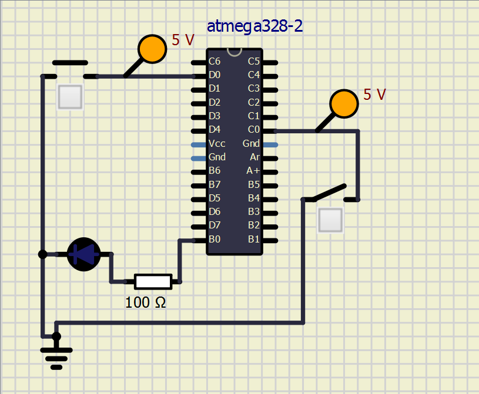
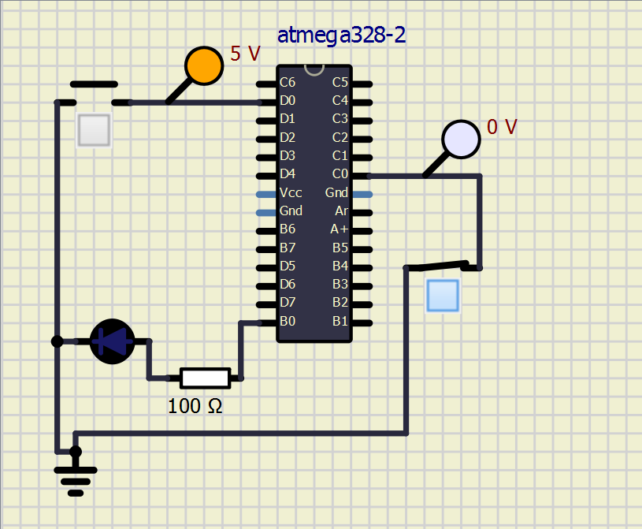
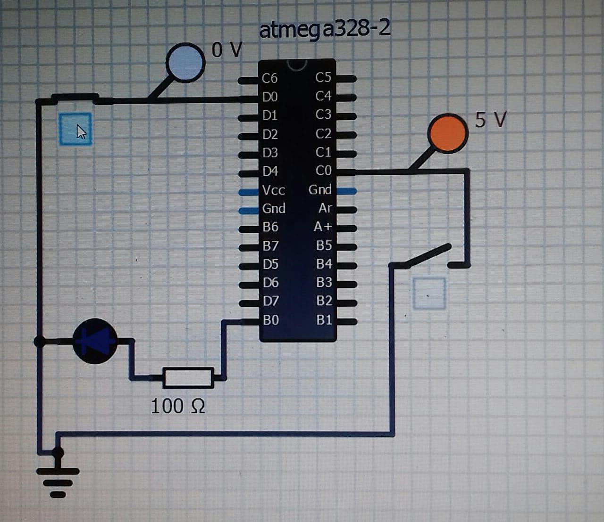
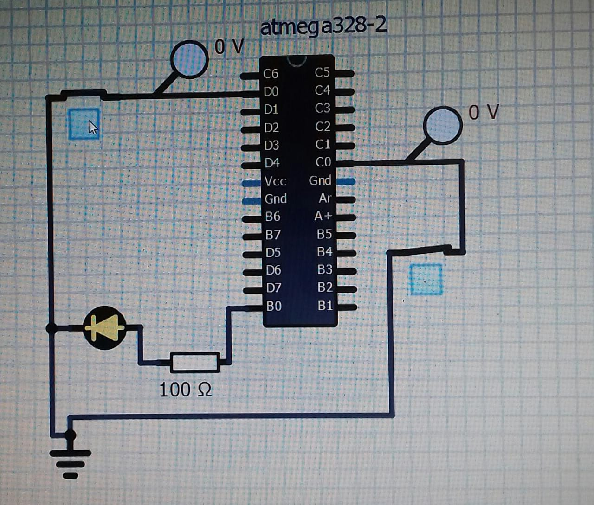
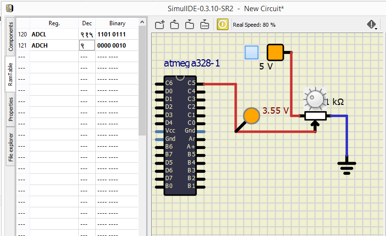
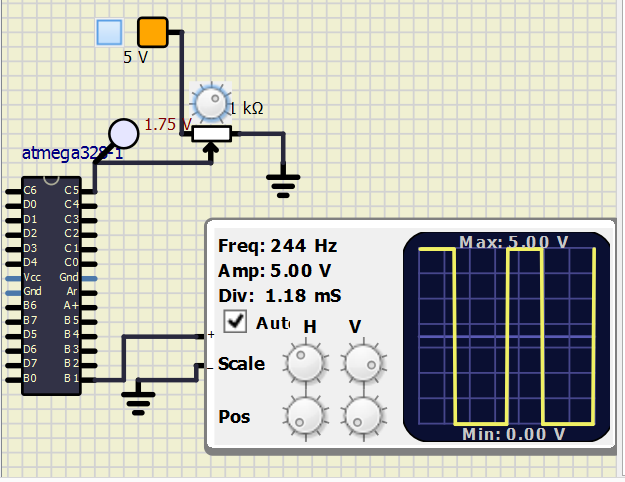
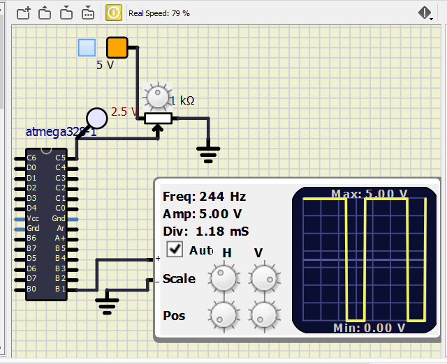
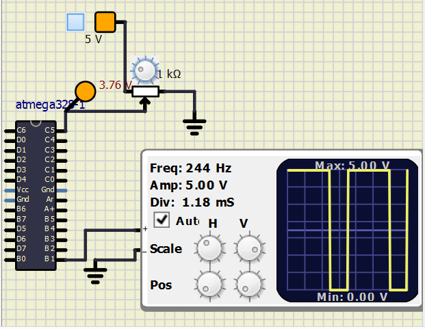
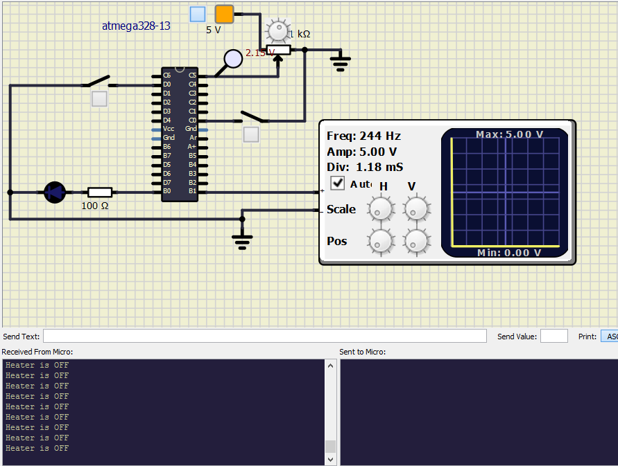
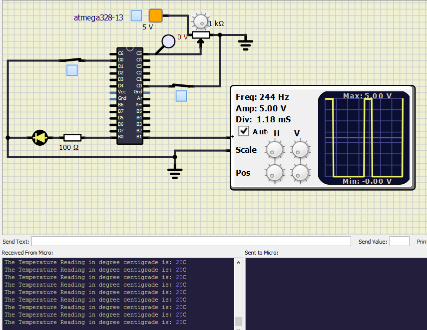

# LTTS stepin Mini Project-2
# Embedded C Programming Activities with Continuous Integration and Code Quality

##### CI and Code Quality

|Build|Cppcheck|Codacy|
|:--:|:--:|:--:|
|||  |

# Activity 1 
   ## If car seat is occupied and heater is ON indicate by turning on a LED using AVR programming
   
### In Action

#### 1. Car seat vacant (button pulled up) and heater switch is off: LED is OFF

#### 2. Car seat vacant and heater switch is on: LED is OFF

#### 3. Car seat is occupied (button pushed down) and heater switch is off: LED is OFF

#### 4. Car seat is occupied and heater switch is on: LED is turned ON

# Activity 2
   ## Use Potentiometer as a temperature sensor and convert the Analog values read from the sensor to Digital values
   
### In Action

#### 1. ADC conversion of temperature sensor 

# Activity 3 
   ## To obtain PWM signal from a Temperature sensor (Potentiometer)

### In Action

#### 1. PWM signal of Duty cycle (D) = 35% 

#### 2. PWM signal of Duty cycle (D) = 50% 

#### 3. PWM signal of Duty cycle (D) = 75% 

# Activity 4
   ## Seat heating app using UART Protocol
   
   ### In Action
   #### 1. When seat button and heater switch are off the system is in OFF state
   
   
    #### 2. When seat button and heater switch are turned on the LED indicator turns on
    #### Potentiometer is varied and temperature is read and the value is displyed on the serial monitor in degree centigrade
    ##### (i) 20 degree celcius
   
